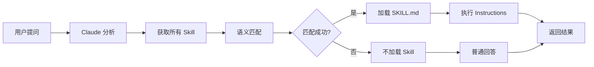

# Claude Code 如何调用单文件 Skill

## 核心调用机制

### 1. 自动发现过程

```
用户提问
    ↓
Claude 读取所有 Skill 的 SKILL.md
    ↓
Claude 检查每个 Skill 的 description 字段
    ↓
description 与用户提问关键词匹配
    ↓
加载匹配的 Skill.md 到上下文
    ↓
Claude 执行 Skill 中的指导
    ↓
返回结果
```

### 2. Description 匹配原理

Claude **通过 NLP 语义匹配** 来判断是否使用 Skill，而不是精确字符串匹配。

#### 示例

```yaml
# SKILL.md
---
name: code-explainer
description: 用通俗易懂的语言解释代码。当用户不理解代码、需要代码讲解、想学习代码原理、或问"这是干什么的"时使用。
---
```

当用户说以下任何一句话时，Claude 都可能触发这个 Skill：

- "这段代码是干什么的？" ✅
- "解释一下这个函数" ✅
- "帮我理解这段代码" ✅
- "这是什么意思" ✅
- "代码讲解" ✅
- "这段程序怎么运行的" ✅
- "这个 class 的作用是什么" ✅

#### 触发失败的情况

- "帮我写代码" ❌ (description 没有提到"编写")
- "这个 bug 怎么修" ❌ (description 没有提到"修复")

---

## 详细调用流程

### 用户视角 - 工作流程

```
1️⃣ 用户在 Claude Code 中提问
   例: "这个二分查找函数怎么理解？"

2️⃣ Claude 内部匹配 Skill
   - 扫描所有 description
   - 找到最相关的 Skill（如 code-explainer）
   - 将 Skill.md 加载到上下文

3️⃣ Claude 执行 Skill 指导
   - 读取 SKILL.md 的 instructions
   - 按照指导进行处理
   - 生成回答

4️⃣ Claude 返回结果
   用户得到符合 Skill 风格的回答
```

### Claude 内部处理

Claude Code 在每次对话时：

1. **初始化 Skill 上下文**
   ```
   - 扫描 .claude/skills/ 目录
   - 读取所有 SKILL.md 文件
   - 提取 name 和 description
   - 存储在内存中
   ```

2. **接收用户提问**
   ```
   用户: "这段代码是干什么的？"
   ```

3. **Skill 匹配（语义相似度）**
   ```
   - code-explainer: 98% 匹配 ⭐
   - bug-finder: 20% 匹配
   - test-writer: 5% 匹配
   
   选择: code-explainer
   ```

4. **加载 Skill 指导**
   ```yaml
   ---
   name: code-explainer
   description: ...
   ---
   
   # Code Explainer
   
   ## Instructions
   1. 先读懂代码的整体功能
   2. 分解成小块逐步解释
   ...
   ```

5. **执行指导**
   ```
   Claude 按照 Instructions 部分来回答用户问题
   ```

---

## 实时演示：单文件 Skill 的调用

### 示例 Skill：bug-finder

```yaml
---
name: bug-finder
description: 查找代码中的 bug。当用户遇到错误、代码不工作、需要排查问题时使用。
---

# Bug Finder

## Instructions

1. 仔细阅读代码
2. 按照检查清单查找问题
3. 按严重程度排序
4. 提供修复建议

## 检查清单

### 常见问题
- 空指针
- 数组越界
- 无限循环
- 逻辑错误
```

### 调用场景

#### 场景 1：用户直接提问

```
👤 用户:
我这段代码有问题，运行时崩溃了。

🤖 Claude:
【自动触发 bug-finder Skill】

我帮你找找问题所在。让我检查：

1. 空指针检查
2. 边界条件
3. 逻辑错误
...
```

**Claude 做的事**：
- 识别用户想要找 bug
- 加载 bug-finder Skill
- 按照 Instructions 来分析代码

#### 场景 2：用户说了相关关键词

```
👤 用户:
这里可能有个 bug

🤖 Claude:
【自动触发 bug-finder Skill】

我来帮你排查问题...
```

#### 场景 3：用户没有精确说出关键词

```
👤 用户:
为什么程序崩溃了？

🤖 Claude:
【自动触发 bug-finder Skill】
【因为"崩溃"与"问题排查"语义相关】

让我分析代码中的问题...
```

---

## Skill 的上下文管理

### 什么时候加载

```
✅ 当用户提问时加载
✅ 当 Skill 内容更新时重新加载
❌ 不会预加载所有 Skill（节省 token）
```

### 上下文大小估算

```
一个简单 Skill:        ~500 token
一个复杂 Skill:       ~2000 token
所有 Skill 合计:       ~10-20K token（取决于数量）
```

---

## 调用失败的常见原因

### 1. Description 不够具体

```yaml
# ❌ 太模糊
description: 帮助处理代码

# ✅ 具体明确  
description: 查找代码中的 bug。当用户代码崩溃、出错、需要调试时使用。
```

### 2. 用户提问没有触发词

```
Skill description: "处理 PDF 文件"

用户: "我需要处理一个文档"  ❌
用户: "我需要处理一个 PDF"   ✅
```

### 3. 多个 Skill 竞争

```yaml
# Skill-1
description: 数据分析和 Excel 处理

# Skill-2  
description: 数据处理和转换

用户: "分析数据"
# Claude 可能不确定用哪个
# 建议：让 description 更具体区分
```

### 解决方案

```yaml
# Skill-1
description: 处理 Excel 文件和生成数据透视表

# Skill-2
description: 处理 CSV 日志文件和生成统计报表
```

---

## 完整调用链



---

## 如何优化 Skill 的调用成功率

### ✅ 最佳实践

1. **Description 包含具体场景**
   ```yaml
   description: 查找 bug。当代码错误、程序崩溃、需要调试时使用。
   ```

2. **Description 包含用户可能说的话**
   ```yaml
   description: 编写测试。当用户需要单元测试、增加覆盖率、或问"怎么测"时使用。
   ```

3. **每个 Skill 职责单一**
   - bug-finder: 只查找 bug
   - test-writer: 只写测试
   - code-explainer: 只解释代码

4. **测试 Skill 是否真的触发**
   ```
   创建后，用 description 中提到的关键词提问
   如果 Claude 没有使用 Skill，调整 description
   ```

### ❌ 避免

- 过于通用的 description
- 名称和 description 不匹配
- 太多相似的 Skill（会造成混淆）

---

## 与 Slash Commands 的区别

| 调用方式 | Slash Commands | Skill |
|---------|---|---|
| **用户操作** | 手动输入 `/命令` | 问问题，Claude 自动选择 |
| **发现** | 明确且可控 | 隐式且自动 |
| **成功率** | 100%（用户明确指定） | 取决于 description 质量 |
| **适用场景** | 快捷操作 | 能力封装 |

---

## 实际测试：创建和验证 Skill

```bash
# 创建 Skill
mkdir -p .claude/skills/my-skill

cat > .claude/skills/my-skill/SKILL.md << 'EOF'
---
name: my-skill
description: 我的自定义技能。当用户需要这个功能时使用。
---

# My Skill

## Instructions
1. 理解用户需求
2. 执行操作
EOF

# 关闭并重启 Claude Code
# 然后提问触发词，观察是否使用了 Skill
```

---

## 总结

Claude Code 调用单文件 Skill 的核心原理：

1. **自动扫描**: 启动时扫描 `.claude/skills/*/SKILL.md`
2. **提取信息**: 读取 name 和 description
3. **语义匹配**: 用户提问时，与所有 description 做语义匹配
4. **动态加载**: 匹配成功时加载对应 Skill
5. **执行指导**: 按照 Instructions 来处理

**关键**: 好的 description = 高匹配率 → 高调用成功率
